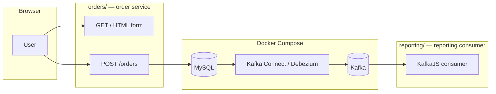

# Debezium CDC: MySQL → Kafka → Node.js

Practice capturing **insert, update, and delete** events from a MySQL `orders` table using **Debezium**, streaming them through **Kafka**, and reacting in a separate Node.js app. This mirrors event-driven flows: the **order service** writes to the database; **reporting** (or any downstream consumer) reacts to CDC events without polling MySQL.

## Architecture



**Flow:** browser → **orders** → **MySQL** (binlog) → **Debezium** → **Kafka** → **reporting**.

## What you need

- [Docker](https://docs.docker.com/get-docker/) and Docker Compose
- Node.js and [pnpm](https://pnpm.io/installation) (workspace installs dependencies for `orders/` and `reporting/`)

## Layout

```text
debezium-cdc/
├── README.md
├── package.json            # Root scripts: pnpm orders | pnpm reporting
├── pnpm-workspace.yaml
├── docker-compose.yml      # Zookeeper, Kafka, MySQL, Debezium Connect
├── init/
│   └── 01-orders.sql       # Debezium user, orders table, seed rows
├── scripts/
│   ├── register-connector.ps1  # POST connector to Connect (Windows)
│   └── register-connector.sh   # same (macOS / Linux / Git Bash)
├── orders/                 # Order service: HTML + POST saves to MySQL
│   ├── package.json
│   └── index.js
└── reporting/              # Subscribes to CDC topic, logs events
    ├── package.json
    └── index.js
```

## Why MySQL runs in Docker too

Kafka Connect (Debezium) runs **inside** a container. With MySQL as a Compose service, the connector uses the hostname **`mysql`** on port **3306** (container port). The **order service** runs on your machine and connects to **`localhost:3307`** (host port mapped in `docker-compose.yml`, chosen so it does not clash with another MySQL already using 3306).

`docker-compose.yml` uses **two Kafka listeners**: `localhost:9092` for host apps (order service does not talk to Kafka; **reporting** does) and `kafka:29092` for containers (Connect).

## 1. Start the stack

```bash
cd debezium-cdc
docker compose up -d
```

Wait until MySQL is healthy and Connect responds at `http://localhost:8083/`.

Install Node dependencies once from this folder (pnpm workspace):

```bash
pnpm install
```

## 2. MySQL init script

`init/01-orders.sql` runs **only on first MySQL data volume**. It creates the `debezium` user, the `orders` table, and seed rows. To re-run from scratch: `docker compose down -v` (deletes DB data).

## 3. Register the Debezium MySQL connector

**Important:** `database.server.id` must differ from MySQL’s `server-id` (`223344` in Compose). The examples use `184054` for the connector. Current Debezium builds require **`topic.prefix`** (here `orders_db`); table events still land on **`orders_db.orders`**. Schema history must use **`schema.history.internal.kafka.bootstrap.servers`** and **`schema.history.internal.kafka.topic`** (the older `database.history.kafka.*` keys are not accepted).

With Connect running on `localhost:8083`, register the connector from the `debezium-cdc` folder:

**PowerShell:**

```powershell
.\scripts\register-connector.ps1
```

**bash** (macOS, Linux, or Git Bash):

```bash
chmod +x scripts/register-connector.sh   # once
./scripts/register-connector.sh
```

Optional: set **`CONNECT_URL`** if Connect is not at `http://localhost:8083/connectors` (must include the `/connectors` path).

**Manual `curl` (equivalent):**

```powershell
curl.exe -X POST -H "Content-Type: application/json" -d "{\"name\":\"mysql-orders-connector\",\"config\":{\"connector.class\":\"io.debezium.connector.mysql.MySqlConnector\",\"tasks.max\":\"1\",\"database.hostname\":\"mysql\",\"database.port\":\"3306\",\"database.user\":\"debezium\",\"database.password\":\"dbz\",\"database.server.id\":\"184054\",\"topic.prefix\":\"orders_db\",\"database.include.list\":\"orders\",\"table.include.list\":\"orders.orders\",\"schema.history.internal.kafka.bootstrap.servers\":\"kafka:29092\",\"schema.history.internal.kafka.topic\":\"schema-changes.orders\"}}" http://localhost:8083/connectors
```

```bash
curl -X POST -H "Content-Type: application/json" \
  --data '{
  "name": "mysql-orders-connector",
  "config": {
    "connector.class": "io.debezium.connector.mysql.MySqlConnector",
    "tasks.max": "1",
    "database.hostname": "mysql",
    "database.port": "3306",
    "database.user": "debezium",
    "database.password": "dbz",
    "database.server.id": "184054",
    "topic.prefix": "orders_db",
    "database.include.list": "orders",
    "table.include.list": "orders.orders",
    "schema.history.internal.kafka.bootstrap.servers": "kafka:29092",
    "schema.history.internal.kafka.topic": "schema-changes.orders"
  }
}' http://localhost:8083/connectors
```

Check status:

```bash
curl http://localhost:8083/connectors/mysql-orders-connector/status
```

CDC events for the table are published to **`orders_db.orders`**.

## 4. Order service (`orders/`)

Small **Express** app:

| Route | Purpose |
|--------|--------|
| `GET /` | HTML page with a form to create an order |
| `POST /orders` | Inserts `product_name`, `quantity`, and `status` into MySQL |

Default DB settings match Compose (`root` / `rootpass`, database `orders`, host `localhost`, port **`3307`** — the published MySQL port). Override with env vars if needed: `DB_HOST`, `DB_PORT`, `DB_USER`, `DB_PASSWORD`, `DB_NAME`, `PORT`.

From `debezium-cdc` (after `pnpm install`):

```bash
pnpm orders
```

Or: `pnpm --filter debezium-cdc-orders start` / `cd orders && pnpm start`.

Open `http://localhost:3000`, submit the form, and rows are written to `orders.orders`.

## 5. Reporting consumer (`reporting/`)

Reads the same Debezium topic as before and prints JSON to the console. Optional env vars: `KAFKA_BROKERS` (default `localhost:9092`), `KAFKA_TOPIC` (default `orders_db.orders`), `KAFKA_GROUP_ID` (default `reporting-group`).

From `debezium-cdc`:

```bash
pnpm reporting
```

Or: `pnpm --filter debezium-cdc-reporting start` / `cd reporting && pnpm start`.

Start **reporting** before or after the connector is up; use `fromBeginning: true` so you see historical messages when you first run (for a fresh consumer group). For day-to-day repeats, either use a **new** `KAFKA_GROUP_ID` or rely on Kafka’s committed offsets.

## 6. Test CDC end-to-end

1. With Docker, the connector, **reporting**, and **orders** running, open `http://localhost:3000` and create an order. **Reporting** should log a **create** (or snapshot-style) event depending on timing and connector state.
2. Optional: run SQL manually (password `rootpass`):

```bash
docker compose exec mysql mysql -uroot -prootpass orders
```

```sql
UPDATE orders SET status = 'shipped' WHERE id = 1;
DELETE FROM orders WHERE id = 2;
```

You should see **update** and **delete** events in the reporting terminal.

## Optional next steps

- Add an **update** flow from the order service and watch reporting.
- Run **two reporting instances** with the same `KAFKA_GROUP_ID` to share partitions, or different groups to duplicate processing.
- Add another table and extend `table.include.list` (or a second connector).

## Troubleshooting

| Issue | What to check |
|--------|----------------|
| Connector `FAILED` | `curl .../status`; MySQL grants; binlog options; MySQL healthy before Connect. |
| Reporting sees nothing | Topic `orders_db.orders`; brokers `localhost:9092`; connector running; consumer group already committed past offsets (try new `KAFKA_GROUP_ID`). |
| Order service cannot connect | From the host, use port **`3307`** (or your `DB_PORT`); Debezium inside Docker still uses `mysql:3306`. |
| Init SQL did not run | Volume already existed — `docker compose down -v` or run SQL manually. |
| Duplicate server id | MySQL `server-id` ≠ connector `database.server.id`. |

## Shutdown

```bash
docker compose down
```

Use `docker compose down -v` only if you want to wipe MySQL data and replay init scripts next time.
